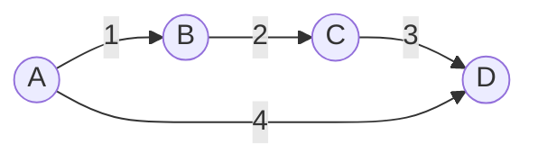

# Traza de Ejecución del Algoritmo Dijkstra

Este documento ilustra paso a paso cómo evolucionan las estructuras de datos clave (`distancia` y `visitados`) durante la ejecución del algoritmo de Dijkstra.

## Grafo de Ejemplo

Utilizaremos el mismo grafo lineal con un "atajo", que permite ver claramente cómo se actualizan las distancias.

*   **Origen:** Nodo **A**
*   **Inicialización:**
    *   `distancia`: { **A: 0**, B: ∞, C: ∞, D: ∞ }
    *   `visitados`: { }

---

## Ejecución Paso a Paso

A continuación se muestra el estado de las estructuras de datos al **final** de cada iteración del bucle principal.

### Iteración 1: Selección de A

1.  **Selección:** De los nodos no visitados {A(0), B(∞), C(∞), D(∞)}, el menor es **A**.
2.  **Marcar como visitado:** A se añade a `visitados`.
3.  **Relajación (Actualización de vecinos):**
    *   Vecino **B**: Distancia actual ∞. Nueva ruta A->B = 0 + 1 = **1**. Se actualiza.
    *   Vecino **D**: Distancia actual ∞. Nueva ruta A->D = 0 + 4 = **4**. Se actualiza.

| Estructura | Estado Actual |
| :--- | :--- |
| **Nodo Actual** | **A** |
| **Visitados** | `{ A }` |
| **Distancias** | `A: 0, B: 1, C: ∞, D: 4` |

---

### Iteración 2: Selección de B

1.  **Selección:** De los no visitados {B(1), C(∞), D(4)}, el menor es **B**.
2.  **Marcar como visitado:** B se añade a `visitados`.
3.  **Relajación:**
    *   Vecino **C**: Distancia actual ∞. Nueva ruta (A->B)->C = 1 + 2 = **3**. Se actualiza.

| Estructura | Estado Actual |
| :--- | :--- |
| **Nodo Actual** | **B** |
| **Visitados** | `{ A, B }` |
| **Distancias** | `A: 0, B: 1, C: 3, D: 4` |

---

### Iteración 3: Selección de C

1.  **Selección:** De los no visitados {C(3), D(4)}, el menor es **C**.
2.  **Marcar como visitado:** C se añade a `visitados`.
3.  **Relajación:**
    *   Vecino **D**: Distancia actual **4**. Nueva ruta (A->B->C)->D = 3 + 3 = **6**.
    *   Como 6 > 4, **NO** se actualiza. Mantenemos el camino más corto previo (el atajo directo A->D).

| Estructura | Estado Actual |
| :--- | :--- |
| **Nodo Actual** | **C** |
| **Visitados** | `{ A, B, C }` |
| **Distancias** | `A: 0, B: 1, C: 3, D: 4` |

---

### Iteración 4: Selección de D

1.  **Selección:** De los no visitados {D(4)}, el menor es **D**.
2.  **Marcar como visitado:** D se añade a `visitados`.
3.  **Relajación:** D no tiene vecinos salientes. No hay cambios.

| Estructura | Estado Actual |
| :--- | :--- |
| **Nodo Actual** | **D** |
| **Visitados** | `{ A, B, C, D }` |
| **Distancias** | `A: 0, B: 1, C: 3, D: 4` |

---

## Resultado Final

El mapa de distancias final contiene los costos mínimos desde A a todos los nodos alcanzables:

*   **A**: 0
*   **B**: 1
*   **C**: 3
*   **D**: 4

El conjunto `visitados` contiene todos los nodos del grafo, indicando que el algoritmo ha terminado correctamente.
